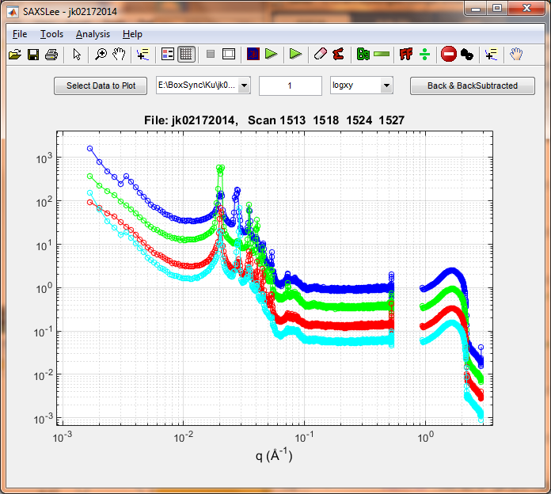

# Overview
This is a software package for plotting 1D SAXS/WAXS curves. It provides some simple analysis tools such as Guinier analysis, Invariant calculation, and so on.

# Installation
Clone the package with git, or download codes from the 'code' pulldown menu, for example as a zip. 

# How to start
1. Define the source, data, and download folders as your matlab path. If not familiar with this, take a look at the direction from Mathworks. [https://www.mathworks.com/help/matlab/matlab_env/add-remove-or-reorder-folders-on-the-search-path.html#:~:text=Change%20Folders%20on%20Search%20Path%20Interactively,-Use%20the%20Set&text=On%20the%20Home%20tab%2C%20in,folders%20to%20MATLAB%20search%20path.]

2. To run SAXSLee, on matlab prompt >> SAXSLee. 

# Tutorials
https://www.youtube.com/watch?v=Hd3XQRj1bUE